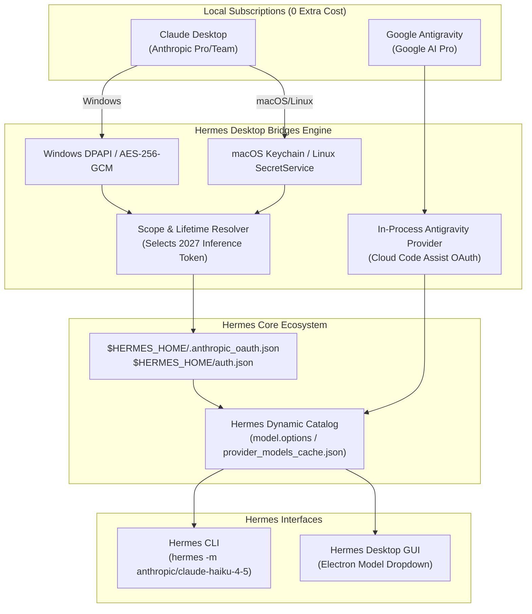

<div align="center">

# ⚡ Hermes Desktop Bridges

**Connect your existing Claude Desktop and Google Antigravity subscriptions to Hermes Agent & Hermes Desktop.**

*Zero API costs • Multi-OS Native • Cryptographic Token Extraction • Seamless Multi-Provider Coexistence*

---

[](LICENSE)
[](https://python.org)
[](docs/ARCHITECTURE.md)
[](https://github.com/nousresearch/hermes)
[](https://buymeacoffee.com/chumari)

</div>

---

## 📖 Overview

If you already subscribe to **Claude Pro / Team** via the official Claude Desktop app, or **Google AI Pro** via Google Antigravity / Cloud Code, you shouldn't have to purchase separate per-token API credits just to use autonomous AI coding agents.

**Hermes Desktop Bridges** bridges your local desktop app subscriptions into **Hermes Agent** (CLI) and **Hermes Desktop** (Electron GUI). It automatically discovers and decrypts your local OAuth credentials, manages multi-year inference tokens, and sets up high-performance routing across Windows, macOS, and Linux.

<div align="center">

[](https://buymeacoffee.com/chumari)

*Enjoying Hermes Desktop Bridges? Consider [buying me a coffee](https://buymeacoffee.com/chumari) to support continued updates and new desktop bridges!*

</div>

---

## 🏗️ Architecture



---

## ✨ Features

- 🔐 **OS-Native Cryptography**: Decrypts Chromium master keys with Windows DPAPI (`CryptUnprotectData`) and AES-256-GCM without external binary dependencies.
- ⏳ **Long-Lived Token Resolution**: Automatically differentiates between 1-hour session tokens (`user:sessions:claude_code`) and persistent multi-year inference tokens (`expiresAt: 2027+`).
- 🔄 **Non-Conflicting Provider Coexistence**: Run Google Antigravity models (`gemini-3.8-flash`) and Claude models (`claude-haiku-4-5`, `claude-sonnet-4-5`) side-by-side without interference.
- 🛡️ **Zero Personal Data Leakage**: Dynamic environment resolution; no tokens, emails, or personal paths are ever stored in source code.
- 🎛️ **Full Hermes Desktop Integration**: Automatically warms the gateway's `model.options` inventory so models appear in the Hermes Desktop UI dropdown.

---

## 🚀 Quickstart (1-Command Setup)

### 1. Clone this Repository
```bash
git clone https://github.com/dchumari/hermes-desktop-bridges.git
cd hermes-desktop-bridges
```

### 2. Install Dependencies
```bash
pip install -r requirements.txt
# or: pip install cryptography pyyaml
```

### 3. Run the Onboarding Wizard
```bash
python scripts/setup_all.py
```
*The wizard detects your installed desktop applications, decrypts and registers credentials, copies the Antigravity plugin, and updates Hermes configuration automatically.*

### 4. Verify Connections
```bash
python scripts/verify_connections.py
```

---

## 🤖 Supported Models

| Provider Slug | Model Identifier | Architecture / Engine | Best For |
| :--- | :--- | :--- | :--- |
| `anthropic` | `anthropic/claude-haiku-4-5` | Claude 3.5 Haiku | Blazing fast agentic completions, zero throttling |
| `anthropic` | `anthropic/claude-sonnet-4-5` | Claude Sonnet 4.5 | High-intelligence code generation & planning |
| `anthropic` | `anthropic/claude-opus-4-5` | Claude Opus 4.5 | Deep reasoning and difficult architecture tasks |
| `anthropic` | `anthropic/claude-sonnet-4-6` | Claude Sonnet 4.6 | Shared 5-hour Pro subscription window |
| `antigravity` | `google-antigravity/gemini-3.8-flash` | Gemini 3.8 Flash | Instant multimodal completions, large context |
| `antigravity` | `google-antigravity/gemini-3.1-pro` | Gemini 3.1 Pro | Complex algorithmic analysis & math |
| `antigravity` | `google-antigravity/claude-sonnet-4-6` | Claude via Cloud Code | Claude served via Google Cloud Code Assist |
| `antigravity` | `google-antigravity/gpt-oss-120b` | GPT-OSS 120B | Open-weight high-parameter execution |

---

## 💻 Usage

### Command Line Interface (CLI)

```bash
# Run Anthropic Claude Desktop
hermes -m anthropic/claude-haiku-4-5 -z "Write a quicksort implementation in Python"

# Run Claude with explicit provider flag
hermes --provider anthropic -m claude-haiku-4-5 -z "Explain async/await"

# Run Google Antigravity Gemini
hermes -m google-antigravity/gemini-3.8-flash -z "Summarize the latest trends in AI"
```

### Hermes Desktop GUI

1. Launch **Hermes Desktop**.
2. In the model dropdown / agent settings, select **Anthropic** or **Google Antigravity**.
3. Both providers appear as authenticated (`authenticated: True`) in the options picker.

---

## 🔄 On-Demand Token Sync

Claude Desktop inference tokens are long-lived (valid for multiple years). If you switch accounts or reinstall Claude Desktop, simply trigger a re-sync:

### Windows:
```cmd
scripts\sync_claude.bat
```

### macOS & Linux:
```bash
chmod +x scripts/sync_claude.sh
./scripts/sync_claude.sh
```

---

## 📂 Documentation

- [System Architecture & Cryptography](docs/ARCHITECTURE.md)
- [Claude Desktop Setup & Lifetime Guide](docs/CLAUDE_DESKTOP_SETUP.md)
- [Google Antigravity Setup Guide](docs/ANTIGRAVITY_SETUP.md)
- [Troubleshooting & FAQs](docs/TROUBLESHOOTING.md)
- [Agent Skill Guide](skills/hermes-desktop-bridges/SKILL.md)

---

## ☕ Support the Project

If **Hermes Desktop Bridges** saves you money on API costs or accelerates your autonomous coding workflow, consider buying a coffee to support continued development and maintenance:

<div align="center">

[](https://buymeacoffee.com/chumari)

☕ **Direct link:** [buymeacoffee.com/chumari](https://buymeacoffee.com/chumari)

</div>

## 💼 Commercial & Custom Engineering (Freelance)

> Need custom local LLM routing, desktop reverse-engineering, DPAPI/Keychain credential adapters, or autonomous multi-agent pipelines built for your startup?  
> **I take on selective freelance contracts and architectural advisory.**  
> 📩 **Get in touch:** [dchumari@gmail.com](mailto:dchumari@gmail.com) | GitHub: [@dchumari](https://github.com/dchumari)

---

## 🗺️ Roadmap & Ecosystem

- [x] **Python CLI Core**: 100% Free and open-source forever.
- [x] **In-Process Antigravity Provider**: Zero-latency Cloud Code Assist routing with non-interception safety.
- [ ] **Background Auto-Sync Tray App**: 1-click Windows & macOS system tray utility for automated multi-day silent token refresh.
- [ ] **Next Desktop Adapters**: Reverse-engineering and bridge support for Cursor IDE & Windsurf desktop tokens.

---

## 🤝 Contributing

Contributions are welcome! If you have improvements for Linux SecretStorage, macOS Keychain integration, or support for additional desktop clients, please submit a pull request.

---

## 📄 License

This project is licensed under the [MIT License](LICENSE).
