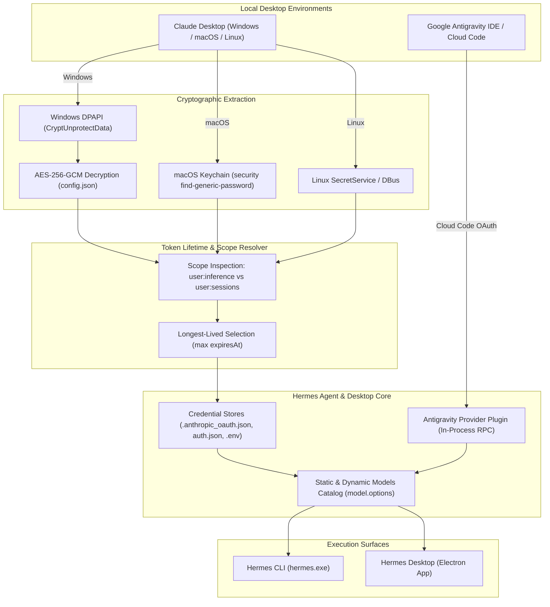

# System Architecture & Technical Specifications

This document outlines the credential discovery, cryptographic unwrapping, lifetime resolution, and routing mechanics powering `hermes-desktop-bridges`.

---

## 1. High-Level Architecture



---

## 2. Windows Claude Desktop Cryptographic Extraction

Claude Desktop on Windows is packaged as an MSIX application located in:
`%LOCALAPPDATA%\Packages\Claude_pzs8sxrjxfjjc\LocalCache\Roaming\Claude`

It stores its OAuth session cache inside `config.json` under the key `oauth:tokenCacheV2`.

### Cryptographic Steps:
1. **Master Key Extraction**:
   - The Chromium-derived master key is stored in `Local State`:
     ```json
     {
       "os_crypt": {
         "encrypted_key": "RFBBUEk..."
       }
     }
     ```
   - The base64-decoded bytes begin with the ASCII header `b"DPAPI"`.
   - The remainder (`encrypted_key[5:]`) is passed to Windows DPAPI `CryptUnprotectData` via `ctypes.windll.crypt32.CryptUnprotectData`, yielding the 256-bit AES master key.

2. **Token Cache Decryption**:
   - The value of `oauth:tokenCacheV2` in `config.json` is base64-decoded.
   - It begins with the version header `b"v10"` (3 bytes).
   - The initialization vector (nonce) is extracted from bytes `[3:15]` (12 bytes).
   - The ciphertext is extracted from bytes `[15:]`.
   - Decryption is performed via standard AES-GCM:
     ```python
     aesgcm = AESGCM(aes_key)
     decrypted_json = aesgcm.decrypt(nonce, ciphertext, None)
     ```

---

## 3. Token Scopes & Expiration Lifetime Mechanics

A critical discovery in Claude Desktop's token cache is the coexistence of multiple scoped credentials:

| Key / Scope Type | Target Scopes | Typical Lifetime | Behavior with Messages API |
| :--- | :--- | :--- | :--- |
| **Session Token** | `user:inference user:file_upload user:profile user:sessions:claude_code` | ~1 hour | Revoked/invalidated quickly; causes `401 Unauthorized` |
| **Desktop Inference Token** | `user:inference user:file_upload user:profile` | **Multi-year (~2027)** | **Stable, persistent inference token** |

### Selection Algorithm:
The bridge inspects all decrypted token cache entries, filters for those possessing `user:inference`, and selects the candidate with the maximum `expiresAt`:
```python
candidates = [v for k, v in cache.items() if "user:inference" in k and v.get("token")]
target_entry = max(candidates, key=lambda x: x.get("expiresAt", 0))
```
This guarantees the multi-year token is selected.

---

## 4. Google Antigravity In-Process Provider

Google Antigravity operates via Google Cloud Code Assist OAuth. The bridge:
- Hooks into Hermes via the `antigravity-provider` plugin located at `$HERMES_HOME/plugins/antigravity-provider`.
- Performs on-the-fly JSON schema sanitization in `transform.py`:
  - Enforces explicit `type` definitions when `anyOf` constructs are present.
  - Coerces string-formatted integer constraints (e.g. `maxItems`) into real JSON integers to meet Cloud Code Assist validation requirements.
- Implements strict non-interception in `hermes_plugin.py` so that requests intended for Anthropic Claude or other providers are never accidentally captured by the Antigravity router.
